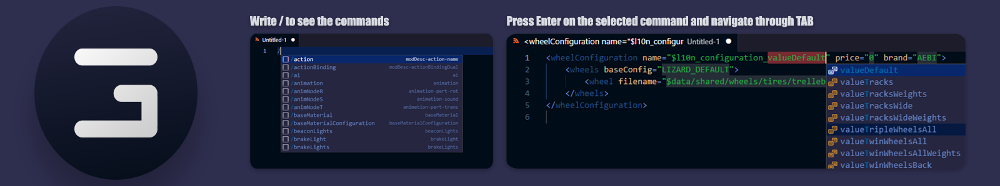

# FS22 Snippets

This is a set of commands that make it easier to develop mods for Farming Simulator 22.

## What is provided in the plugin:

XML

- Designing moddesc.xml using commands
- Designing vehicle.xml using commands

LUA

- MathUtil. functions
- Utils. functions
- DebugUtils. functions (some)

# Vehicle XML Snippets
| Snippet                           | Description | Values |
| ----------------------------------| ----------- | ------ |
| `/text`                           | L10n Text Entry | `name`, `en`, `de` | 
| `/action`                         | modDesc action name | `name`, `category`, `axisType`, `locked` | 
| `/actionBinding`                  | Action binding, full axis | `action`, `device`, `input`, `axisComponent`, `neutralInput`, `index` |
| `/animNodeT`                      | Animation Node - Translate | `node`, `startTime`, `endTime`, `startTrans`, `endTrans` |
| `/animNodeR`                      | Animation Node - Rotate | `node`, `startTime`, `endTime`, `startRot`, `endRot` |
| `/animNodeS`                      | Animation Node - Sound | `template`, `startTime`, `direction`, `volumeScale`, `pitchScale`, `linkNode` |
| `/component`                      | Component | `centerOfMass`, `solverIterationCount`, `mass` |
| `/joint`                          | Joint | `component1`, `component2`, `node`, `rotLimit`, `transLimit` |
| `/objectChangeT`                  | objectChange Translation | `node`, `translationActive` |
| `/objectChangeR`                  | objectChange Rotation | `node`, `rotationActive` |
| `/objectChangeV`                  | objectChange Visibility | `node`, `visibilityActive`, `visibilityInactive` |
| `/objectChangeCC`                 | objectChange Compound Child | `node`, `translationActive` |
| `/wheelConfiguration`             | Additional Wheel Configuration | `name`, `price`, `brand`, `filename`, `configId` |
| `/hose`                           | Hose attacher | `inputAttacherJointIndices`, `type`, `node`, `length`, `diameter`, `straighteningFactor`, `outgoingAdapter`, `socket` |
| `/sharedLight`                    | Shared Light | `linkNode`, `filename` |
| `/tensionBelts`                   | Tension belts framework | `triggerNode`, `rootNode`, `jointNode`, `forceAcceleration`, `addBelt-->template`, `removeBelt-->template` |
| `/tensionBelt`                    | Individual tension belt | `startNode`, `endNode`, `intersectionNode-->node` |
| `/configurationSets`              | Configuration sets framework | `configurationSets-->name`, `configuration-->name`, `configuration-->index` |
| `/movingPartT`                    | Moving part with translatingPart | `node`, `referencePoint`, `referenceFrame`, `isActiveDirty`, `maxUpdateDistance`, `translatingPart-->node` |
| `/movingPartB`                    | Moving part with no translatingPart | `node`, `referencePoint`, `referenceFrame`, `isActiveDirty`, `maxUpdateDistance` |
| `/foliageBending`                 | Foliage bending base | `minX`, `maxX`, `minZ`, `maxZ`, `yOffset` |
| `/i3dMapping`                     | I3D Mapping | `id`, `node` |
| `/baseMaterial`                   | Material Configuration | `name`, `baseNode`, `shaderParameter-->name`, `value`, `useDefaultColors` |
| `/baseMaterialConfiguration`      | Base Material Color | `name`, `color`, `material`, `price` |
| `/designMaterialConfiguration`    | Design Material Color | `name`, `color`, `material`, `price` |
| `/inputAttacherJoint`             | input attacher joint | `node`, `jointType` |
| `/licensePlate`                   | License Plate | `node`, `position`, `preferedType`, `placementArea` |
| `/workArea`                       | Work Area | `type`, `functionName`, `disableBackwards`, `requiresGroundContact`, `needsSetIsTurnedOn`, `startNode`, `widthNode`, `index`, `minLimit`, `maxLimit`|
| `/dependantPart`                  | dependantPart | `node` |
| `/componentJoint`                 | componentJoint | `index` |
| `/movingTool`                     | movingTool | `node` |
| `/ai`                             | AI basic template | `value`, `leftNode`, `node`, `node`, `node` |
| `/states`                         | Light States | `lightTypes`, `lightTypesWork` |
| `/reverseLight`                   | reverseLight | `node` |
| `/turnLightRight`                 | turnLightRight | `node` |
| `/turnLightLeft`                  | turnLightLeft | `node` |
| `/brakeLight`                  	| brakeLight | `node` |
| `/light`                  		| light | `node`, `lightTypes`, `excludedLightTypes` |

## Not all commands have been added yet, there will be LUA snippets in the next update!